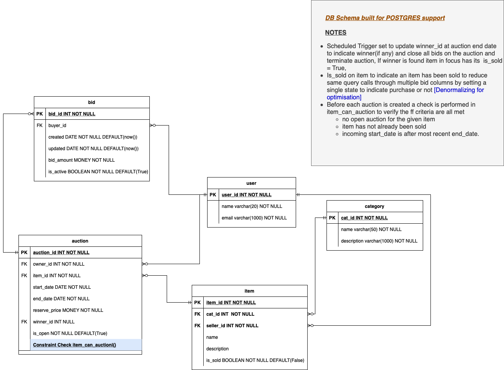

# Databases

## Objectives
- [x] I understand the benefits of relational databases and when to use them
- [x] I can model a relational database using ERDs and DB normalisation
- [x] I can create a relational database in SQL using an RDBMS CLI client
- [x] I can create and drop tables in a relational database
- [x] I can insert, delete and update records in a relational database
- [x] I can run a simple select query on a single table
- [x] I can run a query on multiple tables using JOINs
- [x] I can run queries using GROUP BY and ORDER BY
- [x] I understand the benefits of document databases and when to use them
- [x] I can model a document database
- [x] I can create and drop collections in a document database
- [x] I can insert, delete and update documents in a document database
- [x] I can query document databases

## Some types of databases
1. Relational :  database where the information is organized in tables (two-dimensional arrays)
2. NoSQL(Not only) : database that does not use the tabular schema of rows and columns like in relational databases but rather, its storage model is optimized for the type of data it’s storing.
    - Document-oriented databases
    - Key-Value Stores
    - Wide-Column Stores
    - Graph Stores

## Create database (relational db)
```
CREATE DATABASE db_name;
```

## Drop database (relational db)
```
DROP DATABASE db_name;
```

## Create table (relational db)
```
CREATE TABLE tbl_name (
    column_1 int,
    column_2 varchar(255) <-- follows format -> column_name constraints(type declarations etc) -->
);
```

## Drop table (relational db)
```
DROP TABLE table_name;
```

## Simple select table (relational db)
```
select * from schema.table_name;
```
or
```
select column_1, column_2 from schema.table_name;
```

## Simple select table with filtering (relational db)
```
select * from schema.table_name where column_1=value_1;
```

## Simple select table with sorting (relational db)
```
select * from schema.table_name order_by 'column' desc;
```

## Simple select table with sorting on jsonb(database specific) column (relational db)
```
select * from schema.table_name where column_name->>'username' = 'eliblurr' ;
```
or nested:
```
select * from schema.table_name order by column_name->'key_1'->'key_2'->'key_3' asc ;
```

## Insert into table (relational db)
``` 
insert into table_name (column_1, column_2, ...)
VALUES (value_1, value_2, ...);
```

## Update table (relational db)
```
<--update all-->
update table_name
set column_1 = value_1;
```
or 
```
<--update specific target data by some filtering criteria-->
update table_name
set column_1 = value_1
where column_1=value_1;
```

## Group by queries (relational db)
allows rows to be grouped by some criteria usually by values they have in common
```
select column_name(s) from table_name where condition
group by column_name(s) order by column_name(s);
```

## Create collection (document db)(execute in mongod)
A collection is a grouping of MongoDB documents. general syntax -> db.createCollection(name, options)
```
db.createCollection(collection_name, {size: <number>, max: <number>, ...})
```

## Drop collection (document db)(execute in mongod)
general syntax -> db.COLLECTION_NAME.drop()
```
db.MYCUSTOMCOLLECTION.drop()
```

## Query documents (document db)(execute in mongod)
general syntax -> db.COLLECTION_NAME.find() or db.COLLECTION_NAME.find().pretty()
.pretty() is used to format output
```
db.MYCUSTOMCOLLECTION.find().pretty()
```

## Insert documents (document db)(execute in mongod)
general syntax -> db.COLLECTION_NAME.insert(document)
```
db.MYCUSTOMCOLLECTION.insert(document)
```

## Delete documents (document db)(execute in mongod)
general syntax 
- db.COLLECTION_NAME.deleteOne(): Delete only one document that match a specified filter. 
    ```
        db.collection.deleteOne(
            <filter>, # deletion criteria
            {
                writeConcern: <document>,
                collation: <document>,
                hint: <document|string>        // Available starting in MongoDB 4.4
            }
        )
    ```
- db.COLLECTION_NAME.remove({delete options}): delete one or all that match a specified filter. 
    ```
        db.MYCUSTOMCOLLECTION.remove(
            <query>, # deletion criteria
            <justOne> # boolean that indicates either delete one or many
        )
    ```
- db.COLLECTION_NAME.deleteMany(): Delete all documents that match a specified filter. 
    ```
        db.collection.deleteMany(
            <filter>, # deletion criteria
            {
                writeConcern: <document>,
                collation: <document>
            }
        )
    ```

## Update documents (document db)(execute in mongod)
- db.COLLECTION_NAME.updateOne(<-filter->, <-update->, <-options->)
- db.COLLECTION_NAME.updateMany(<-filter->, <-update->, <-options->)
- db.COLLECTION_NAME.replaceOne(<-filter->, <-update->, <-options->)

## Some links
- [ER modelling and normalisation example for an item auctioning application](images/db-schema-Elvis-Segbawu.drawio.png)
    - 
<!-- - [non relational db modelling](images/placeholder.png)
    -  -->
- [what are relational database](https://www.ibm.com/topics/relational-databases)
- [what are document database](https://aws.amazon.com/nosql/document/)
- [relational vs document database](https://www.pluralsight.com/blog/software-development/relational-vs-non-relational-databases)
- [rdb advantages](https://www.educba.com/relational-database-advantages/)
- [more on relational databases](https://www.pluralsight.com/blog/software-development/relational-vs-non-relational-databases)
- [choosing the right database](https://aws.plainenglish.io/how-to-choose-the-right-database-31af8b0260d3)
- [choosing the right databases (more read)](https://medium.com/wix-engineering/how-to-choose-the-right-database-for-your-service-97b1670c5632)
- [mongodb collections)](https://www.mongodb.com/docs/manual/reference/method/db.createCollection/#mongodb-method-db.createCollection)
- [official mongodb tutorials](https://www.mongodb.com/docs/manual/tutorial/getting-started/)
- [more mongodb tutorials](https://www.tutorialspoint.com/mongodb/index.htm)

## Fun facts
- noSQL stands for not only SQL